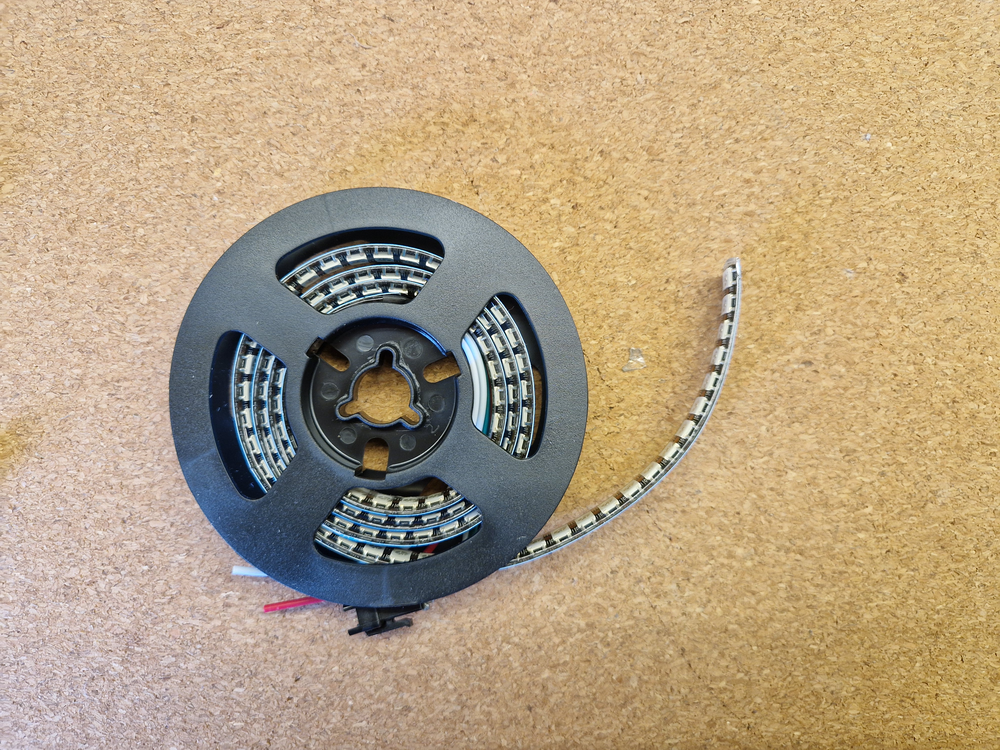
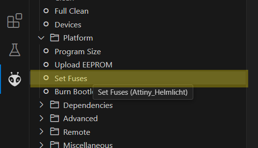
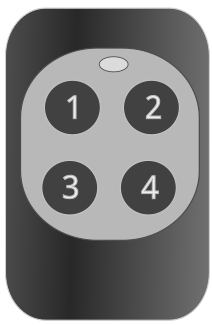
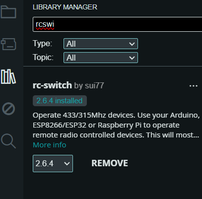
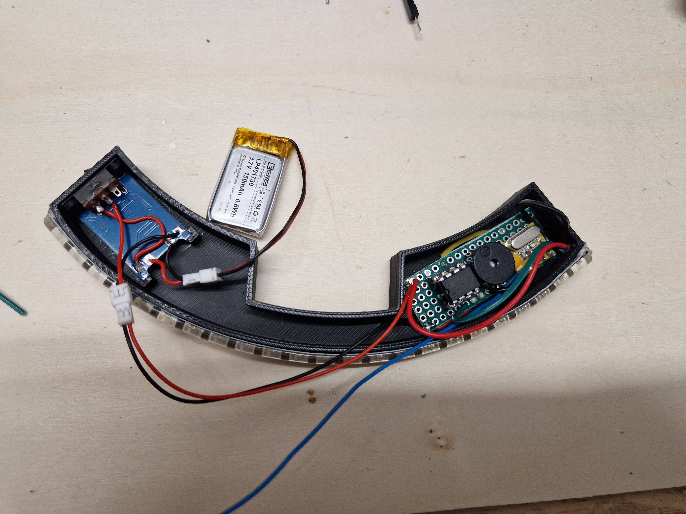
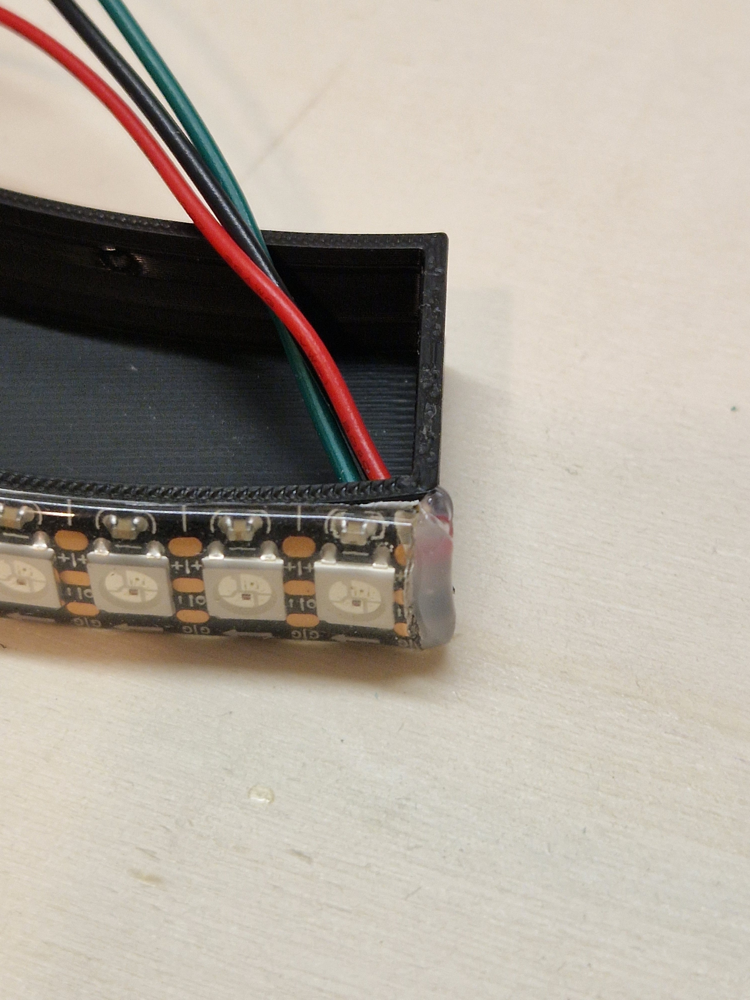
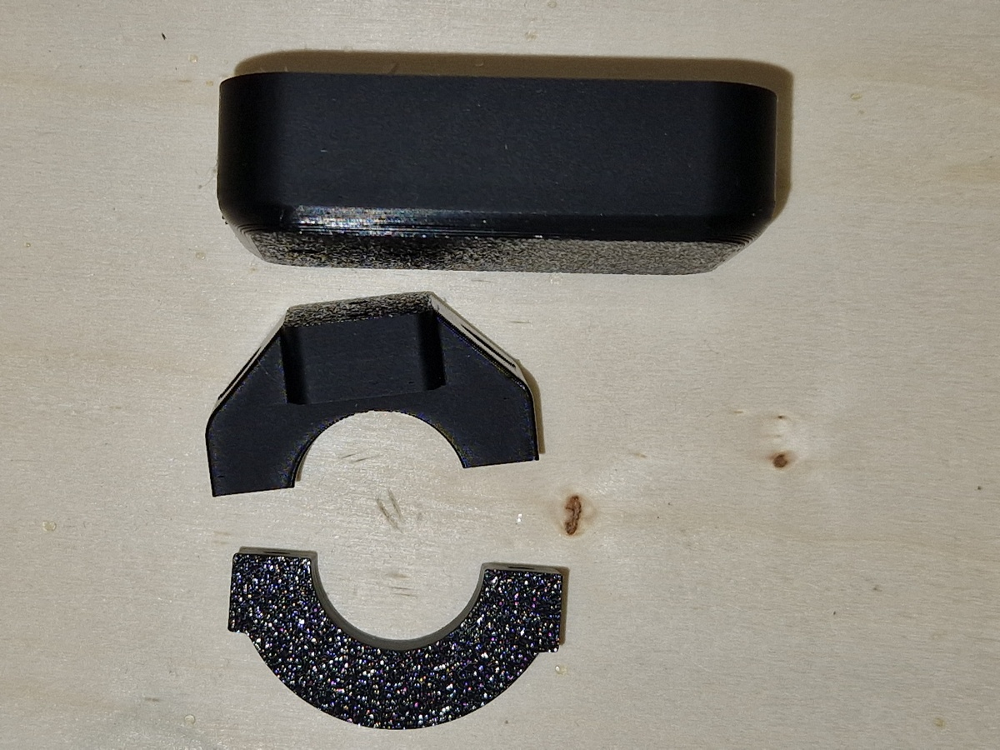
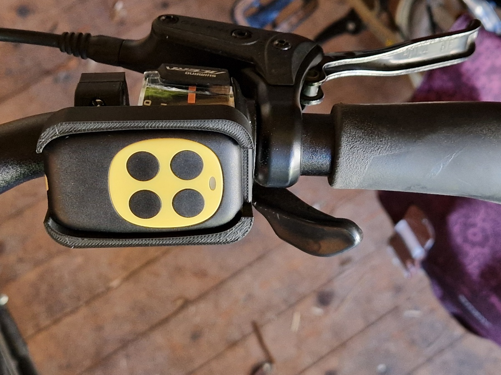
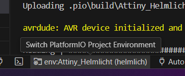
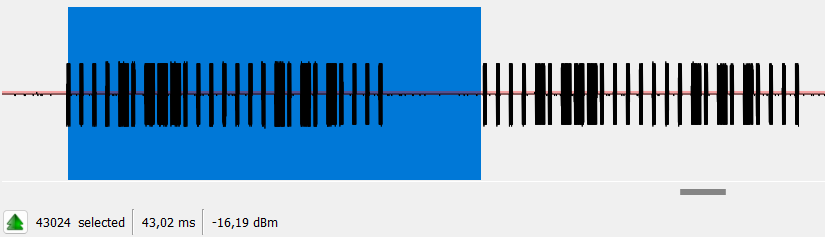

# Helmlicht
Der Fahrradhelm Modell Hud-Y von Abus ähnelt dem eines Roboterhelmes. Als Fan von Filmen wie Robocop definitiv ein Kaufgrund. Die Helme dieses Modells haben ein Rücklicht integriert, das leuchtet und blinkt und das vom Helm entfernt werden kann! Doch wenn man schon einen Robotorhelm hat und ein Rücklicht vorhanden ist, warum soll es dann nicht aussehen wie die "Augen" der Zylonen aus Battlestar Galactica? Und das Rücklicht könnte auch beim Abbiegen blinken, so wie bei Motorräder oder Autos.
Der Fahrradhelm Modell Hud-Y von Abus ähnelt dem eines Roboterkopfes. Als Fan von Filmen wie Robocop definitiv ein Kaufgrund. Die Helme dieses Modells haben ein Rücklicht integriert, das leuchtet und blinkt und das vom Helm entfernt werden kann! Doch wenn man schon einen Robotorhelm hat und ein Rücklicht vorhanden ist, warum soll es dann nicht aussehen wie die "Augen" der Zylonen aus Battlestar Galactica? Und das Rücklicht könnte auch beim Abbiegen blinken, so wie es Motorräder oder Autos machen.
Um das umzusetzen, habe ich eine Box für die Aussparung im Helm als 3D Modell konstruiert, in dem ein ATtiny85 arbeitet. Dieser steuert einen WS2812B LED Strip, einen Piezo Summer und lässt sich über ein 433Mhz Empfängermodul steuern.

Wer das Projekt umsetzen will benötigt einen PC mit installiertem Visual Studio Code, einen Arduino, einen 3D Drucker, ein Lötkolben und das unten aufgeführte Material.


# Stückliste
Folgende Teile werden verbaut:
Bauteil               | Beschreibung | Quelle | Kosten
--------              |--------------|------- | -----
Mikroprozessor  | ATtiny 85-20 PU      | [reichelt](https://www.reichelt.de/8-bit-attiny-avr-risc-mikrocontroller-8-kb-20-mhz-dip-8-attiny-85-20-pu-p69299.html) | 1,70€
Mikroprozessor  | ATtiny 85-20 PU      | [reichelt](https://www.reichelt.de/8-bit-attiny-avr-risc-mikrocontroller-8-kb-20-mhz-dip-8-attiny-85-20-pu-p69299.html) | 1,70€
IC-Sockel             | GS 8P IC-Sockel, 8-polig| [reichelt](https://www.reichelt.de/ic-sockel-8-polig-superflach-gedreht-gs-8p-p8231.html) | 0,30€
Piezo Speaker         | DC-Signalgeber, 85dB | [reichelt](https://www.reichelt.de/dc-signalgeber-85db-2300-hz-3-v-pb12n23mpw03aq-p360872.html)| 0,92€
433Mhz Receiver | 433Mhz Superheterodyne RXB14| [ebay](https://www.ebay.de/itm/263855073600?var=563220548601)|1,19€
Schiebeschalter | Mini Schiebeschalter SS2212F15VG6 3 Pol, 2 Gänge| [ebay](https://www.ebay.de/itm/315307042120?var=613779717314)| 2,20€*
Lipo Lademodul|  USB-C 18650 tp4056 Lithium-Batterie Lademodul | [aliexpress](https://de.aliexpress.com/item/1005005982385924.html)| 1,37€
Lipo Akku| 3,7 V 150-300mAh Lipo-Batterien mit PCM| [aliexpress](https://de.aliexpress.com/item/1005006680244682.html)| 1,43€
LED Strip| WS2812 144LEDs/meter Schwarz IP65, 12mm| [amazon](https://www.amazon.de/dp/B088JPLP2H)| 15,99€*
Magnete | Neodym Magnete 8x2mm| [amazon](https://www.amazon.de/dp/B0CPJ1GJKS)| 6,99€*
JST Stecker |  Micro JST 1,25mm 2 Pin Male & Female| [aliexpress](https://de.aliexpress.com/item/1005004732865407.html)| 2,44€*
Perf Board | Lochplatine KitsDoppelseitig| [amazon](https://www.amazon.de/gp/product/B09NDNPF91)| 9,99€*
Funkfernbedienung| Programmierbare Funkfernbedienung 433Mhz| [aliexpress](https://de.aliexpress.com/item/1005006065464456.html)| 3,09€
Schrauben Lenkerklemme|2 Blechschrauben 3,5 x 19 Linsenkopf | [Baumarkt Bauhaus](https://www.bauhaus.info/blech-metall-spenglerschrauben/marinetech-blechschraube/p/23672451)| 0,42€
Schrauben RC-Platte|2 Blechschrauben 3,5 x 13 Linsenkopf | [Baumarkt Bauhaus](https://www.bauhaus.info/blech-metall-spenglerschrauben/marinetech-blechschraube/p/23672442)| 0,36€
Sonstiges|Verbindungskabel, Filament, Heiß- oder Sekundenkleber 
*) Set oder Meterpreise (06/2024)





# Programmierung
Die Programmierung des ATtiny erfolgt über [Visual Studio Code](https://code.visualstudio.com/download) und dem Plugin [Platformio](https://platformio.org/). Über <code>Platformio::Upload</code> wird der ATtiny über den Arduino programmiert, der vorher als ISP programmiert wurde.

Für die Programmierung des ATtiny benötigt man ein Programmiergerät oder ein Arduino Board. Setzt man den ATtiny auf ein Breadboard und verwendet den Arduino als ISP Programmer, können an den Anschlüssen des ATtiny zugleich auch die später zu verbauenden Module getestet werden. Es ist nicht notwendig, den LED Strip, das Funkmodul oder auch den Piezo Summer beim Programmieren zu entfernen. Lässt man alles verbaut, kann man so oft man will die Programmierung wiederholen.  

## Vorbereitung des Arduino Boards und des ATtiny
Der Code um den Arduino als ISP nutzen zu können ist Teil der Examples der Arduino IDE: https://www.arduino.cc/en/software
Dazu wird der Arduino über USB mit dem Rechner verbunden, und mit dem Skript File/Examples/11.ArduinoISP programmiert ([Arduino Examples](https://docs.arduino.cc/built-in-examples/arduino-isp/ArduinoISP/))

Der Arduino wird gemäß Pin Layout angeschlossen:


Nicht vergessen: Sollte der Arduino (nicht der ATtiny) erneut programmiert werden, muss der Kondensator entfernt werden.

Falls direkt getestet werden soll, ob die Schaltung korrekt programmiert wurde, können alle später verbauten Module auf dem Breadboard mit Jumperkabel angeschlossen werden, um die Funktion zu prüfen (siehe Bild unten).


Der angeschlossene Piezo Buzzer wird jetzt beim Programmiervorgang einige Geräusche machen. Davon sollte man sich nicht irritieren lassen, der Programmiervorgang sollte trotzdem erfolgreich sein.

## Programmierung über PlatformIO
Nachdem der Arduino als ISP programmiert wurde, kann die Arduino IDE geschlossen werden. Sie wird im Projekt nicht mehr benötigt. Statt dessen wird Visual Studio Code eingesetzt mit dem Plugin PlatformIO. Folgende Schritte sind in der Reihenfolge auszuführen:
- Download und Installation von [VS Code](https://code.visualstudio.com/download)
- PlatformIO IDE als Plugin installieren
- Visual Studio Code das Plugin Arduino installieren
- Port des angeschlossene ISP-Arduinos in platformio.ini unter <code>upload_port</code> eintragen
- Fuse Einstellung für den ATTiny85 setzen über Project tasks/.../Set Fuses (s.u.) 
- Upload durchführen (s.u.)

In der Ini-Datei platmormio.ini wird nun die Konfiguration für den ATTiny85 eingetragen wie in [platfomio.org ](https://docs.platformio.org/en/latest/boards/atmelavr/attiny85.html#) beschrieben. Für das Projekt sind bereits alle notwendige Einstellungen festgelegt worden. Lediglich der Port muss noch eingetragen werden der bei Windows im Gerätemanager unter Ports zu finden ist und bei Linux über <code>ls /dev/tty*</code> angezeigt wird.

Der ATtiny muss bei 8Mhz betrieben werden sonst versagt die FastLED Bibliothek ihren Dienst. Damit trotzdem das Timing korrekt funktioniert muss die CKDIV8-Fuse mit dem Wert <code>CKDIV8=0</code> deaktiviert sein. Dazu wird die lfuse auf <code>0xE2</code> gesetzt. Um diesen Wert zu setzen muss unter
PLATFORMIO(Ameisenkopf linke Steuerungsleiste)/Project tasks/Platform/Attiny_Helmlich/Set Fuses per Klick ausgeführt werden.



Wenn das alles erfolgreich war, kann der Code für den Mikrocontroller hochgeladen werden. Dazu auf den winzigen Pfeil nach rechts ganz unten klicken (PlatformIO:Upload).

Im Terminal sollte sich der Upload mit Status SUCCESS beenden.

# Fernbedienung


Als Steuerung des Helmlichtes wird eine programmierbare 433Mhz Fernbedienung verwendet. In der Regel werden diese Fernbedienungen schon vorprogrammiert geliefert. Der Default Code des Models, das in der Stückliste angegeben wurde, ist in platformio.ini übernommen worden:

Taste | Default-Code | Funktion
-----|-------| --
1 | 753832 |  Blinker Links
2 | 753828 | Blinker Rechts
3 | 753826 | Animation wechseln
4 | 753825 | Blinker aus

Das kann aber bei der nächsten Produktionslinie schon wieder anderes aussehen. Wer feststellt, dass die Fernbedienung nicht funktioniert sollte den Code auslesen. Wie das geht ist unten beschrieben. Auch wer einen anderen, vielleicht kürzeren Code möchte, kann diesen in der platform.ini unter <code>build_flags</code> eintragen.

## Fernbedienungscode auslesen
Um zu überprüfen, welchen Code die Fernbedienung sendet, kann das Skript [TestRemote.ino](./src/Utils/TestRemote/TestRemote.ino) verwendet werden. Es gibt zum Upload kein Environment in diesem Projekt, um das Skript auf den Arduino zu laden. Statt dessen kann die [Arduino IDE](https://www.arduino.cc/en/software/) verwendet werden. Vor dem ausführen muss die Bibliothek rc-switch noch installiert sein:



Anschließend das Skript auf den Arduino hochladen und den Serien Monitor starten.

Soll die Fernbedienung programmiert werden, wird ein weiteres Hardware-Modul benötigt. Ein Sendemodul wie das MX-FS-03V (FS1000A) reicht dafür aus. Zum senden kann der hier als Grundlage verwendet Code des Projektes rc-switch [rc-switch](https://github.com/sui77/rc-switch/) verwendet werden. Dazu die Arduino IDE starten, ein neues Skript öffnen und für <code>taste1</code> folgenden Code in den Sketch kopieren:
```cpp
#include <RCSwitch.h>

RCSwitch mySwitch = RCSwitch();

void setup() {
  Serial.begin(9600);
  //Modul Data an Arduino PIN10
  mySwitch.enableTransmit(10);  
}

void loop() {
  mySwitch.send(753832, 24);
}
```
Den Arduino starten und die Fernbedienung den Code lernen lassen.<br> 
Bei den meisten aus China stammenden lernenden Fernbedienungen muss dazu in der Lernvorgang gestartet werden z.B. durch gleichzeitiges Drücken der Taste (1) und (2) bis die Fernbedienungs-LED dreimal blinkt. Anschließend (2) drücken. Danach die Fernbedienung in die Nähe des Sendemoduls halten und den gewünschten Knopf (z.B. 1) solange gedrückt halten, bis aus dem Blinken der LED ein Flackern geworden ist.
Anschließend im Sketch den Code der nächsten zu programmierende Taste ändern, auf den Arduino laden und die Taste gedrückt halten, welche programmiert werden soll. Das jetzt solange wiederholen bis alle Tasten programmiert worden sind.

# Montage

Für die Montage muss die Helmlicht Box ausgedruckt werden. Auch wenn PLA als Druckmatrial zunächst ausreicht, wäre für den intensiven Outdoor Einsatz ASA eventuell geeigneter. Hinweis: der Deckel der Box wird nur verpresst und ist nicht komplett wasserdicht. 

## Lademodul und Schalter
Den Schiebeschalter und das Lademodul mit Kabeln und Steckern verbinden. Der LiPo Akku wird per JSP-Zweifachstecker verlötet und kann so gewechselt werden. Die Steuerungsplatine wird ebenfalls per Stecker verbunden. Das macht das montieren und austauschen einfacher. <p>
Liegt die Box mit den LEDs zu einem zeigend, wird auf der linken Seite das Akku-Lademodul in die Aussparung geklemmt. Dabei darauf achten, dass die Status LEDs des Lademoduls nach unten zeigen. Der Schiebeschalter wird mit den ausgedruckten Nieten an der Box verschmolzen. Dazu die Nieten durch die Montagelöcher schieben und mit einem Lötkolben von aussen verschmelzen. Auf der Linken Seite sollte nun noch soviel Platz sein, dass der Akku so in den Platz gelegt werden kann, dass der Deckel sich schließen lässt.


## LED Streifen
Der LED Strip wird auf 23 LEDs gekürzt. Die Anschlusspunkte lassen sich am besten auf der Rückseite mit einem Cuttermesser freikratzen und mit den drei Kabeln verbinden. Auf die Pfeilrichtung achten, welche auf dem Strip aufgedruckt werden. Die Pfeile symbolisieren der Datenflussrichtung und sollten vom Lötpunkt wegweisen. Die Anschlussdrähte müssen auf die erste LED verlötet werden. Den Strip auf die Box kleben und die Kabel durch die Öffnung fädeln. Für den besseren Halt und zur Abdichtung und Isolierung, die hindurch gefädelten Kabel und den Strip an der Stelle mit Heißkleber fixieren.



Der Strip kann sich auf der anderen Seite nach einiger Zeit wieder lösen wenn das KLebeband nicht gut haftet. Ein Tropfen Sekundenkleber an der letzten Stelle behebt dieses Problem.


## Steuerungsplatine
Das PCB Board wird auf 18 Loch lang und 6 Loch breit gekürzt. Es lässt sich zusägen oder es werden mit einem Cutter Messer die Bruchkanten eingeritzt, um anschließend mit einer Zange die überstehenden Bereiche abzuknicken.
Anschließend den Sockel, den Buzzer und das RC Modelauflöten und die Lötverbindungen herstellen. Das Empfangsmodul um 90° biegen, damit der Deckel auf die Box passt. Vorsicht, die Pins brechen schnell. Stromkabel mit JST Kabel anlöten. LED Kabel anlöten, den Akku anschließen und den Schiebeschalter umlegen, um den ersten Test durchzuführen.  

## Magnete
Die Magnete dienen lediglich zum besseren Halt des Helmlichtes. In die runden Aussparungen je einen Tropfen Sekundenkleber geben und die Magnete einsetzen.


## Fernbedienungshalter
Der Halter für die Fernbedienung, der an den Lenker des Fahrrades montiert werden kann, ist eine Schale, in der die Fernbedienung eingeklemmt wird. Dadurch ist diese auch leicht wieder zu entfernen und der Halter insgesamt recht einfach aufgebaut. Um den Halter an dem Lenker zu befestigen, werden 13 und 19 mm langen Blechschrauben verwendet.

Zuerst die Datei ./3dPrint/PrintFiles/Bedienungshalter-*-Druck.3mf ausdrucken werden. Ob die Fernbedienung Horizontal (was mir mehr entgegen kommt) oder Vertikal auf dem Lenker liegt ist Platz und Geschmackssache.



Zuerst die Halterung am Lenker schrauben. Dazu die 3,5x19 Blechschrauben verwenden. Danach mit den 3,5x13 Blechschrauben die Halterplatte festschrauben. Die Fernbedienung nun einfach eindrücken.
Als Material für den Druck war hier PLA ausreichend. Wer mehr UV Stabilität benötigt kann andere Materialien ausprobieren, ggf. muss hier mit der Skalierung des Slicers nachgesteuert werden, wenn die Fernbedienung zu stramm ode rzu locker sitzt. 



Wer eine andere Fernbedienung hat, kann dafür eine andere Grundplatte herstellen. Die Rohdaten sind alle im Ordner [/3dPrint/Remote](./3dPrint/Remote/) vorhanden. Zur Konstruktion wurde die Community Editon von Siemens [Solid Edge](https://resources.sw.siemens.com/de-DE/download-solid-edge-community-edition) verwendet.


# Fertig
Jetzt nur noch das selbst gebaute Helmlicht einschalten und in den Helm stecken. Die Fernbedienung in die Halterung und los geht's.


<br><br><br><br><br>

---

# Sonstiges
## Environments Utils
Unter dem Ordner Util sind alternative Main-Methoden, die ich für die Entwicklung und den Test der Konstruktion genutzt habe. Insbesondere wenn man noch nie eine ATtiny programmiert hat oder auch den Arduino nicht besonders gut kennt ist es sinnvoll erst einmal zu schauen, ob die Grundlegenden Dinge funktionieren.

Default ist die Environment auf Attiny_Helmlicht gestellt. Damit wird das Hauptprogramm deployt. Um den Default zu ändern muss im VS Code in der IDE unten auf die Einstellung klicken und eine andere Enrironment wählen: 



## BlickTest
Um den Attiny, der eingesetzt werden soll, zu testen wird dieses simple Programm verwendet. Es steuert eine LED an und lästs diese Blinken. Dies ist ein Smoketest, ob der 
eingesetzte Mikrocontroller, bzw ob die Programmierung, Ausführung und Ansteuerung mit visual Studio funktioniert.

## SimpleremoteTest
dieser Aufbau benötigt zwei LEDs um zu testen, ob das Empfängermodul funktioniert. Das kann man auch dann schon nutzen, ohne den restlichen Aufbau bereitzustellen. Es war für mich auch ein PoC, ob es mit dem ATtiny überhaupt möglich ist einen Blinker umzustetzen. 

## LedStripTest
Hier habe ich verschiedene Blinkmuster ausprobiert. Nicht alles was so im Netz gezeigt wird geht auch auf dem ATtiny. Ausserdem haben wir einen sehr limitierten Speicher was den Sourcecode angeht. Bei meinem letzten Build waren es nur noch 18%, den man für zusätzlichen Code hätte verwenden können. Der ATtiny85 hat nur 8Kb Flash, der mit dem FastLED dem angepassten RCSwitch schon gut gefüllt ist.

## Ausblick
Einige Ideen habe ich noch im Kopf aber noch nicht verwirklicht. 
- So hatte ich vor, den "Black" Mode noch als Blinkmuster aufzunehmen. So, dass nur der Blinker leuchtet.
- den Fernbedienungshalter so konstruieren, dass die Fernbedienung diebstahlsicher eingesetzt werden kann
- Der Sound wurde ursprünglich für ein Piezo Element entworfen und klingt bei einem Buzzer oder Summer natürlich anderes. Statt eines Buzzers / Signalgebers kann auch eine Piezoscheibe eingesetzt werden. In der Blinkpause könnte so statt des schrägen Tons eine einsekündige Melodie gespielt werden. Oder eine Startmelodie.
- Die Bauhöhe ist vor allem durch den 8Pin Sockel erhöht worden. Es passt zwar alles noch in den Helm, ist aber trotzdem ein wenig gequetscht. Den Sockel habe ich gewählt, um das Helmlicht nachträglich neu programmieren zu können. Ginge auch anderes, mit vier Pins an denen die MOSI, MISO, SCK und Reset Leitungen angeschlossen werden. Strom bekäme der Tiny durch den Akku. Oder man wählt gleich einen anderen Attiny der mit einem Pin programmiert werden kann.
- Ein anderer ATtiny. Der 85 hat den Vorteil, dass der in DIP Bauform lieferbar ist. Damit kann er einfach auf einem Perf-Board gelötet oder, so wie ich es gemacht habe, in einen Socket gesteckt werden. Neuere Modelle mit mehr Flash und der Möglichkeit nur über einen PIN programmiert zu werden, gibt es leider nur noch in SOIC Bauform.

## Hintergründe
### Timings und Clock
https://community.platformio.org/t/attiny-8mhz-wrong-timing-in-delay-fastled-and-neopixel/24992/4
HIer werden Probleme angesprochen, dass der delay nicht rictig fuktioniert weil die CPU unter 1Mhz läuft bei eingestellten 8 
!! Es kann auch ein Grund dafür sein, dass der NEOPiXEL nicht meh rrichtig klappt

Auf dieser Seite gibt es einen Taktrechner: https://www.engbedded.com/fusecalc/ und noch mehr. Es gibt hier einige Einstellungen die über Fuse geregelt werden und die das Verhalten der ATtiny vor dem Startup regeln.

### RX Module
Der XY-MK-5V ist das Standardmodul für 433Mhz Funkübertragung meist im Set mit dem FS1000A, Der Sender und der Empfäger sind relative primitive Konstruktionen, bei der eine Spule in Schwingung versetzt wird und diese Schwingung beim RX Modul verstärkt an dem Datenpin angelegt wird.
Der XY-MK-5V ist ein Pendlerempfaenger, mit einer sehr geringen Reichweite. Ausserdem scheint er kein sauberes Signal zu liefern, so dass ein Sender in unmittelbarer Entfernung zum Empfänger stehen muss. Desweiteren braucht der Empfänger zwingen mehr als 3V Spannung, um zu funktionieren. 
Besser sind hier Superheterodyne Empfänger die auch bei 3V saubere Ergebisse erzielen. Hervorrangend. der RXB14, dieser hat eine sehr kleine Bauform und arbeitet zuverlässig schon bei 3V und kann damit auch mit einer Knopfzelle betrieben werden. Der Verbrauch würde dabei bei ca. 6.88 mW liegen. Bei einer Kapazität einer Cr2032 von 0,22 Ah wären ein Betrieb von 95 Stunden also ca 4 Tagen Dauerbetrieb möglich.

### Besonderheiten bei FastLED
FastLED ist eine recht mächtige und unter allen Bibliotheken, die programmierbare Neopixel vom Typ WS281X LEDs ansteuern, bei dem Funktionsumfang die schnellste (siehe [Jake's Blog](https://blog.ja-ke.tech/2019/06/02/neopixel-performance.html))

Ausserdem bietet es für AVR Prozessoren und damit auch dem ATtiny optimierte Algorithmen und auch eine Reihe von Util Funktionen, die speziell für 8Bit Prozessoren entwickelt wurden. Trotzdem ist die Bibliothek klein genug, um auf den Flash Speicher des ATtiny noch Platz für das eigene Programm zu lassen.

#### Interrupt Probleme
Beim Schreiben von WS2812-Daten werden von FastLED Interrupts deaktiviert. Das bedeutet, dass während des Schreibens alle auftretenden Interrupts verzögert werden, bis der Schreibvorgang beendet ist. Pro WS2812-LED werden 30 µs fürs schreiben benötigt. 
Für unser Projekt haben wir 23 LEDs im Einsatz = 690 µs = 0,7 ms.
D.h. es werden für etwa 1ms alle Interrups deaktiviert, auch die auf welcher die Fernbedienungssignale ankommen. 

Da für jedes Bit, drei Sendeimpulse zur dekodierung verlangt werden und jeder Impulse 300-350µs lang sein muss, würde ein Stop der Verarbeitung am Interrupt-PIN eine Lücke bei der Datenverarbeitung auslösen und die von der Fernbedienung empfangenen Daten können nicht mehr korrekt ausgewertet werden bzw. hat der dekodierte Code nicht den erwarteten Werten.

*Ist das für das Projekt ein Problem?*

Wird während der Dekodierung des Fernbedienungssignals der LED Strip mit Daten versorgt geht die Information der Fernbedienung verloren. Solange aber zwischen dem Neuschreiben der Daten <code>FastLED.show()</code> immer ein delay eingebaut wurde, der größer ist, als die Laufzeit zur Dekodierung der Sendeimpulse, und die Fernbedienung solange Daten sendet wie der Knopf gedrückt wird, sollte es immer ein Zeitfenster geben, an dem Teile der Fernbedienungssignals (das eine Sequenz an Codewiederholungen ist) korrekt interpretiert werden.

Im Detail:<br>


Pro bit werden zur Identifizierung 3 Impulse benötigt:<br> 
= 32bit * 3 Impuse = 72 Impulse <br>
= 33.600 us = 34 Millisekunden für ein Signal <br>
zusätzlich noch die Pause zwischen den Signalen etwa 4 ms. In Summe demnach <b>38 ms</b> für ein komplettes Signal

Würden fortlaufend LED Daten geschrieben oder der delay zwischen dem erneuten Schreiben der LED Daten wäre deutlich zu klein (<50ms>) würden zu viele Signal nicht interpretiert werden können und die Fernbedienung ist wirkungslos oder macht den Eindruck nicht immer zu funktionieren. Das sollte man immer im Auge behalten wenn neue Animationen für den LED Strip erstellt werden, die eine hohe fps erfordern.

Eine Lösung könnte der Einsatz von kürzeren, als 8bit kodierten Signalen sein, die mehr Signallücken bei einer Sendesequenz haben. Ich habe das auch ausprobiert, konnte aber, mit den aktuell eingesetzten Animationen,  bei der Reaktionsfähigkeit des Helmlichts keinen Unterschied feststellen. 


## Funktionserklärung rc-switch und die Anpassungen
### ATtiny 
Für den ATtiny wurden der Boolean RCSwitchDisableReceiving auf true gesetzt weil der Compiler einen Fehler wirft: udivmodhi4 fehlt. Allerdings ist die udivmodhi4 mit der ATtinycore lib auch nicht nötig. Es funktioniert also auch so. Allerdings muss die Einbettung in das Interupt Management geändert werden, da der Arduino Befehl attachInterrupt hier nicht funktioniert. Also diese Zeile mit dem RCSwitchDisableReceiving auskommentieren, ebenso ded Aufruf interruptChange().

### Signalverarbeitung
Die Herausforderung bei der Signalverarbeitung ist es zuerst, die Störungen herauszufiltern und dann das Signal korrekt zu interpretieren. Dies wird wie folgt gemacht:
- Es wird ein Array vorbereitet, in dem die Zeiträume zwischen der ansteigenden und abfallenden Flanke des Signalpins des Empfangsmoduls gespeichert werden.
- Die Funktion handleInterrupt wird in die Interuptverarbeitung des ATtiny eingehängt.
  - es wird der Abstand seit dem letzten Signal bestimmt, das angekommen ist.
  - Wenn der Abstand seit dem letzten Aufruf länger als 4300 micros ist (das ist wird eine Signallücke sein) dann
    - wird der Schreib-Cursor für das Array der Signal zurückgesetzt (egal was vorher war). Fängt also wie der bei  0 an.
    - wenn das eine Signallücke ist (am Anfang oder zwischen den Signalen) und diese schon das zweite mal auftritt
      - dann könnte eine ganze Signalkette vorliegen, diese wird an receiveProtocol weitergegeben zum analysieren
  - Passen die aufgezeichneten Flankenabstände zum Protokoll, wird nach dem Protokoll der Binärcode und der Dezimalwert des Signals bestimmt, und als aktueller Code abgespeichert. 
- Bei der Abfrage von RCSwitch, ob ein Signal vorliegt wird nun true zurück geliefert, der code kann ausgelesen werden wird als aktueller Zustand des Helmlichtes gespeichert und ausgewertet
- Jetzt wird RCSwitch zurückgesetzt für das nächste Signal. 

## Weiterführende Links

Titel | Hintergrund | Quelle
-----|--------|---------
Erste Schritte mit ATtiny|Leider ein Bezahlartikel, aber erst durch diesen Artikel habe ich den Anstoß erhalten das Projekt umzusetzen. Allein weil der ATtiny so stromsparend ist und mit Battrie betrieben werden kann machte das Projekt er möglich. (Viele freie Artikel sind auch bei Wolles Elektronikkiste weiter unten zu finden)| [Heise Make Artikel](https://www.heise.de/ratgeber/Erste-Schritte-mit-ATtiny-Guenstige-Alternativen-fuer-kleine-Hardware-Projekte-9654461.html) 
Speicherverbrauch in Mikrocontrollern erklärt| Bei der Experimentierphase habe ich alle möglichen Bibliotheken in der main.css eingebunden auch solche die später vergessen habe. Da hier nicht wenige Konstanten definiert sind und durch den Code unnötig Speicherplatz belegt wurde, konnten kompliziertere Blinkmuster nicht abgespielt werden. Offensichtlich hat der mangende Speicherplatz zu Problemen bei der Ausführung geführt. Dieser Artikel beschreibt den Speicheraufbau eines Mikrocontrollers bei ATM.  | [Heise Make Artikel](https://www.heise.de/ratgeber/Speicherverbrauch-in-Mikrocontrollern-erklaert-9730630.html)
Attiny85 Datasheet| Die offizielle Dokumentation. Hier wird unter anderen beschrieben wie der Speicher aufgebaut ist (siehe auch oben) und die Fuse funktionieren. Wenn etwas hier nicht dokumentiert ist, gibt es die Funktion auch nicht. | [Datenblatt des ATtiny 85](https://ww1.microchip.com/downloads/en/devicedoc/atmel-2586-avr-8-bit-microcontroller-attiny25-attiny45-attiny85_datasheet.pdf)
Wolles Elektronikkiste | Hier finden sich Details und Hintergründe zur Programmierung des ATtiny. Ebenso habe ich dort gelernt wie das Funken über 433Mhz funktioniert. Alles verständlich erklärt und gut beschrieben. Ein Fundgrube gerade auch für Anfänger (in der Welt der Mikrocomputer) oder Personen, die noch lernen wollen. | [wolles-elektronikkiste.de ](https://wolles-elektronikkiste.de/)
Dave's Garage | Der Youtube Chanel des LED Begeisterten ehemaligen Microsoft Entwicklers David Plummer. In den Episoden 06 bis 09 wird beschrieben wie mit dem WS2812 coole Effekte erzeugt werden können. Sie dienten als Inspiration und als Erinnerung daran, dass der LED Strip, den wir einsetzen, 16 M Farben darstellen kann, 256-fach dimmbar.| [Github Repro mit Beispielen](https://github.com/davepl/DavesGarageLEDSeries) <br> [Episode 6, der Komet Effekt](https://www.youtube.com/watch?v=yM5dY7K2KHM&list=PLqZiTnLvpldhp2_pTo5WplS8zRoiuOt19&index=7)
Speicherverbrauch in Mikrocontrollern|Dieser Artikel erklärt, wo im Arbeitsspeicher (RAM) welche Art von Daten gespeichert werden. |[Heise Artikel](https://www.heise.de/select/make/2024/3/2410108002281679788)
FastLED Wiki | Wiki Dokumentaion des FastLED Projektes mit vielen Tipps und Hintergrundwissen | [FastLED Github Repro](https://github.com/FastLED/FastLED/wiki/)


    

